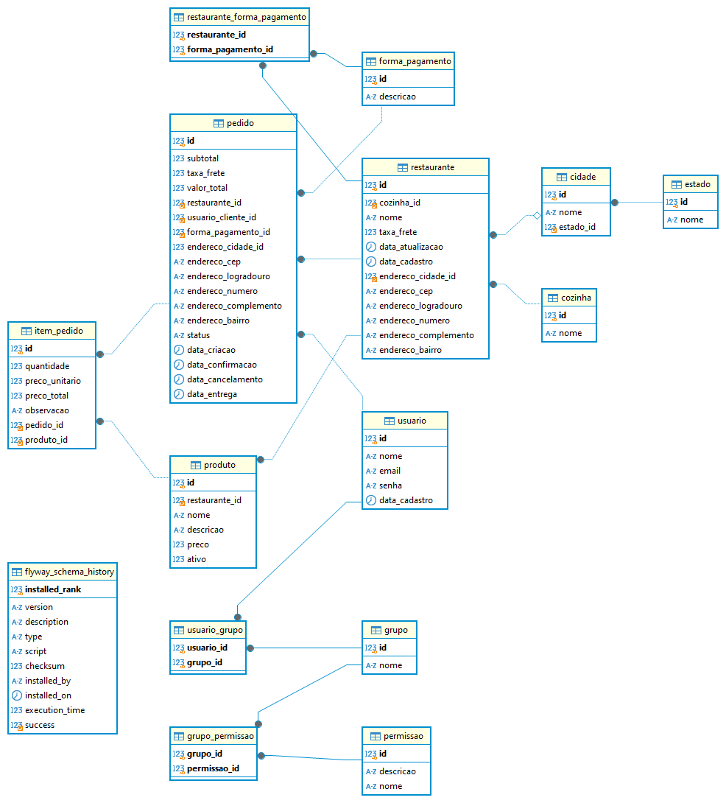

# Algafood API

Algafood API é um projeto em desenvolvimento durante o curso de Especialista em Spring Boot, com o objetivo de construir uma API para delivery de comida. O projeto implementa um modelo de domínio abrangente que está em constante evolução.

## Tecnologias Utilizadas

- **Java 17**
- **Spring Boot 3.2.2**
- **Maven**
- **JPA/Hibernate**
- **MySQL**
- **Lombok**

### Modelo de Domínio

Atualmente, a estrutura do modelo de domínio é composta pelas seguintes entidades:

- **Cidade**: Representa uma cidade e tem uma relação com a entidade `Estado`.
- **Estado**: Representa um estado.
- **Restaurante**: Representa um restaurante e está relacionado com `Cozinha`.
- **Cozinha**: Representa o tipo de cozinha do restaurante.
- **FormaPagamento**: Representa os métodos de pagamento aceitos.
- **Permissao**: Representa as permissões que podem ser atribuídas a usuários.

### Diagrama de Entidades

> **Nota:** O diagrama acima representa a estrutura atual do modelo de domínio em desenvolvimento. Mais entidades e relações podem ser adicionadas conforme o projeto avança.

## Dependências do Projeto

As principais dependências utilizadas no projeto são:

- **Spring Boot Starter Web**
- **Spring Boot Starter Data JPA**
- **MySQL Connector/J**
- **Lombok**
- **Spring Boot Starter Test**
- **Spring Boot DevTools**

## Como Executar o Projeto

### Pré-requisitos

Certifique-se de ter os seguintes itens instalados na sua máquina:

- **Java 17** ou superior
- **Maven** (para gerenciamento de dependências)
- **MySQL** (para o banco de dados)

1. **Clonar o repositório**:
   git clone 

2. **Navegue até o diretório do projeto**:
   cd algafood-api

3. **Configure o banco de dados**:
   - Certifique-se de que o MySQL esteja rodando na sua máquina.
   - Inicie o gerenciador de banco de dados.
   - Atualize as credenciais do banco de dados no arquivo `application.properties`:
     spring.datasource.url=jdbc:mysql://localhost:3306/algafood
     spring.datasource.username=seu-usuario
     spring.datasource.password=sua-senha

4. **Instale as dependências do projeto**:
   mvn clean install

5. **Execute a aplicação**:
   mvn spring-boot:run
   A aplicação estará disponível em `http://localhost:8080`.

6. **Acesse a API**:
   Utilize uma ferramenta como o `Postman` ou `curl` para fazer requisições à API.

